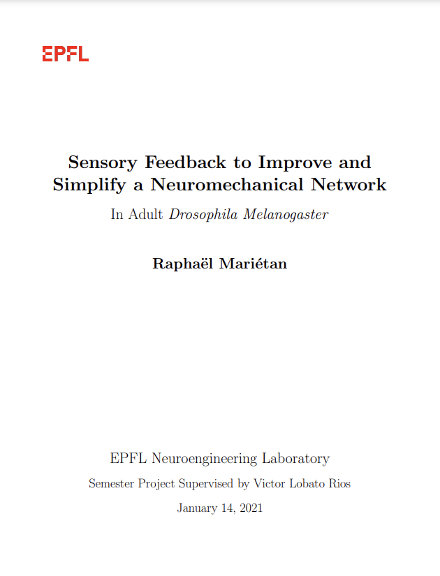

# Towards Reconstructing Graph-Based Models of Neuronal Arborizations from 3D Microscopy Scans

This repository contains the implementation of project described in the [project report](res/final_report.pdf). The implementation code is private and has not been publicly released so all the scripts are left empty on this repository.

## Abstract :

A substantial part of scientific research and in particular scientific experimentation is
nowadays relying on in vivo experiments conducted on animals, or on in vitro experiments
using cell culture or small organisms. The high complexity of certain processes and environments, which makes them hard to record in vivo or to reproduce in vitro, along with the
rise of computing technologies, have kept on pushing experimentation to renew itself and
to try to complement the current experimentation techniques with computational models.
Drosophila melanogaster is widely used as a model organism for research in various fields
such as genetics and physiology, therefore making the development of an in silico model
for it particularly useful. The goal of this project was to review the mechanisms of sensory
feedback in insect locomotion both on an intra-leg and on an inter-leg coordination level,
and to incorporate them to the simulation with the aim to reduce the complexity of the
network and to improve the efficiency of the simulated gait. With the added contribution
of the implemented sensory input, the current neuromechanical model of the Drosophila
melanogaster is able to produce a realistic and adaptive locomotion pattern
while reducing the number of oscillators required to generate the gait.
The simulation is able to adapt its sequence of events and its locomotion pattern to
the sensory information coming from the other leg joints and from the other legs. Even
when perturbations are applied to the inter-leg phases, the model tends to converge to a
tripod-like gait within a few gait cycles. The current implementation provides the tool
necessary for the future development of more complex and realistic mechanisms of insect
locomotion, such as the elevator reflex necessary to locomote on uneven terrain.

## Animation of the fly

